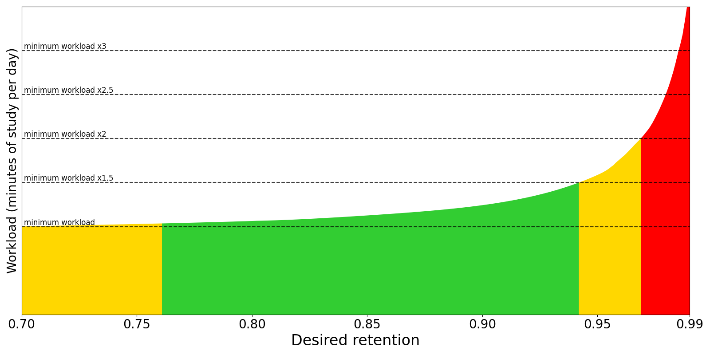

# Параметры колод

<!-- toc -->

Параметры колод в первую очередь контролируют то, как Anki планирует повторение карточек. Рекомендуется сначала несколько недель поработать с настройками по умолчанию, чтобы понять, как работает Anki, прежде чем начинать их корректировать. **Пожалуйста, убедитесь, что вы понимаете настройки, прежде чем менять их, так как ошибки могут снизить эффективность Anki.**

На вашем компьютере выполните любое из следующих действий, чтобы открыть параметры колоды:

- Нажмите на значок шестерёнки на экране колод.
- Выберите колоду на экране колод, а затем нажмите **Параметры** внизу экрана.
- Нажмите «**Ещё** > **Настройки**» в режиме изучения.
- Нажмите <kbd>O</kbd> в режиме изучения.

Вот несколько сообщений от сообщества о настройках колод, опубликованных в прошлом:

- [Варианты колод: объяснение](https://forums.ankiweb.net/t/deck-options-explained/213)
- [Варианты колоды на ментальной карте](https://forums.ankiweb.net/t/deck-options-in-a-mental-map/15757)

## Конфигурации

Anki позволяет вам делиться настройками между разными колодами, чтобы упростить одновременное обновление настроек во многих колодах. Для этого настройки группируются в конфигурацию (набор настроек). Если вы измените настройку в конфигурации, это изменение применяется ко всем колодам, использующим ту же конфигурацию. Все вновь созданные колоды используют конфигурацию "По умолчанию".

Чтобы изменить настройки в одной колоде, но не в других, нажмите значок стрелки в правом верхнем углу окна Параметры колоды (выпадающий список у кнопки "Сохранить"). Вы можете сделать следующее:

- **Сохранить**: Сохранить все изменения, которые вы сделали в настройках колоды.
- **Добавить конфигурацию**: Добавит новый набор настроек для этой колоды с настройками по умолчанию.
- **Клонировать конфигурацию**: Клонировать ваш текущий набор настроек, что полезно, если вы хотите изменить некоторые настройки, но оставить остальные как есть.
- **Переименовать конфигурацию**: Изменить имя текущего набора настроек.
- **Удалить конфигурацию**: Удалить текущий набор настроек. Это превратит вашу следующую синхронизацию в [одностороннюю синхронизацию](./syncing.md#Конфликты).
- **Сохранить во все подколоды**: Как **Сохранить**, но также назначает выбранный набор настроек всем подколодам текущей выбранной колоды.

Параметры колод не имеют обратной силы. Например, если вы измените параметр, контролирующий задержку после неудачного ответа, то карточки на которые вы ответили неудачно до изменения этого параметра так и будут иметь старую задержку, а не новую.

## Подколоды

Если ваша колода имеет подколоды, и вы хотите, чтобы одна или несколько из них имели другие настройки, отличные от родительской колоды, вы можете назначить этим подколодам отдельные конфигурации. Когда Anki показывает карточку, он проверит, в какой подколоде находится карточка, и использует настройки для этой колоды. Есть два исключения:

- Это **Новых карточек в день** и **Максимум повторяемых в день** – подколоды влияют на количество карточек, которые могут быть взяты из этой подколоды. Но общее количество карточек, которое вы видите во время сессии изучения, контролируется лимитами колоды, которую вы выбрали для изучения.
- Настройки [порядка показа](#Порядок-показа) берутся из колоды, которую вы выбрали для изучения, а не из колоды текущей карточки.

Например, предположим, у вас есть такая коллекция:

    - Колода A (Конфигурация 1)
      - Колода A::Подколода B (Конфигурация 2)

Конфигурация 1 и Конфигурация 2 идентичны, за двумя исключениями:

- Конфигурация 1:
  - **Шаги изучения**: `1m 10m`
  - **Порядок новых/повторений**: `Перемешать с повторяемыми`
- Конфигурация 2:
  - **Шаги изучения**: `20m 2h`
  - **Порядок новых/повторений**: `Показывать после повторяемых`

Если вы выберете для изучения Подколоду B:

- Шаги обучения для всех новых карточек будут `20m 2h` (применяется Конфигурация 2).
- Все новые карточки будут показаны после повторений (применяется Конфигурация 2).

Если вы выберете для изучения Колоду A:

- Шаги обучения для новых карточек в Колоде A будут `1m 10m` (применяется Конфигурация 1).
- Шаги обучения для новых карточек в Подколоде B будут `20m 2h` (применяется Конфигурация 2).
- Все новые карточки будут смешаны с повторяемыми (применяется Конфигурация 1).

## Дневные лимиты

### Новых карточек в день

Эта опция контролирует, сколько новых карточек может быть введено в каждый день, когда вы открываете программу. Если вы изучаете меньше лимита или пропускаете день, на следующий день счетчики вернутся к исходному значению: вам не будет показано больше карточек, чем позволяет ваш лимит.

При изучении колоды, внутри которой есть подколоды, лимиты, установленные для каждой подколоды, контролируют максимальное количество карточек, извлекаемых из этой конкретной колоды. Лимиты выбранной колоды контролируют общее количество карточек, которые будут показаны.

Для более ранних версий см. [эту страницу FAQ](https://faqs.ankiweb.net/the-anki-2.1-scheduler.html).

Изучение новых карточек временно увеличивает количество повторений, которые вам нужно делать в день, поскольку вновь изученный материал необходимо повторить несколько раз, прежде чем интервал между повторениями сможет заметно увеличиться. Если вы стабильно учите 20 новых карточек в день, можно ожидать, что ежедневные повторения составят примерно 200 карточек/день. Вы можете уменьшить количество требуемых повторений, вводя меньше новых карточек каждый день, пока ваша нагрузка по повторениям не снизится. Многие пользователи Anki в восторге изучали сотни новых карточек в первые несколько дней использования программы, а затем были перегружены необходимыми повторениями.

### Максимум повторяемых в день

Позволяет установить верхний предел количества карточек для повторения, показываемых каждый день. Когда этот лимит достигнут, Anki не будет показывать больше карточек для повторения в этот день, даже если их еще много. Если вы занимаетесь регулярно, этот параметр может помочь сгладить случайные пики в количестве карточек, подлежащих повторению, и может уберечь вас от сердечного приступа при возвращении в Anki после недельного перерыва. Когда повторения были скрыты из-за этой опции, на экране поздравлений появится сообщение, предлагающее вам рассмотреть возможность увеличения лимита, если у вас есть время.

При изучении колоды, содержащей подколоды, лимит повторений ведет себя аналогично лимиту новых карточек.

Anki включает любые изучаемые карточки, которые [перешли через границу дня](./preferences.md#Расписание) (междневные изучаемые карточки), в счетчик повторений, поэтому эти изучаемые карточки будут подчиняться лимиту повторений.

### Дневные лимиты для конкретной колоды

Можно использовать одну и ту же конфигурацию для разных колод с индивидуальными лимитами для каждой из них. Это устраняет необходимость создавать клонированные конфигурации только для этой цели и упрощает установку пользовательских лимитов для подколод.

Anki предлагает три варианта для дневных лимитов:

- **Конфигурация**: применяется ко всем колодам, использующим эту конфигурацию.
- **Эта колода**: специфично для конкретной колоды.
- **Только сегодня**: специфично для конкретной колоды и временно.

### Лимит повторений не влияет на новые

По умолчанию лимит повторений также применяется к новым карточкам, и новые карточки не будут показываться, когда лимит повторений достигнут. Если эта опция включена, новые карточки будут показываться независимо от лимита повторений.

Если у вас есть отставание по просроченным карточкам для повторения, рекомендуется прекратить вводить новые карточки, пока вы не наверстаете это отставание. Продолжение введения новых карточек, когда вы уже отстаете, может усугубить отставание.

### Лимины начинаются сверху

По умолчанию дневные лимиты вышестоящей колоды не применяются, если вы выбираете одну из ее подколод. Родительская колода может иметь лимит новых карточек 10 карточек/день, а ее подколоды — лимит новых карточек 20 карточек/день. Лимиты, установленные для родительской колоды, не влияют на количество новых карточек, которые вы можете изучить из ее подколоды.

Когда эта опция включена, лимиты, установленные для вышестоящих колод, также применяются к их подколодам при выборе подколоды. В предыдущем примере вы сможете изучить только 10 новых карточек из подколод вместо 20 новых карточек.

Эта опция может быть полезна, если вы хотите изучать отдельные подколоды, соблюдая при этом общий лимит на карточки во всех подколодах.

## Новые карточки

Параметры здесь влияют только на новые карточки и [изучаемые карточки](getting-started.md#Состояния-карточки). Как только карточка достигнет статуса "Повторяемая" (то есть пройдет все шаги обучения), параметры в этом разделе перестают на нее влиять.

### Шаги изучения

Управляет количеством повторений при изучении и интервалом между ними. Необходимо ввести один или несколько интервалов, разделенных пробелами. Каждый раз, когда во время повторения вы нажимаете **Хорошо**, карточка переходит к следующему шагу. Каждый раз, когда вы нажимаете **Снова**, карточка возвращается к первому шагу.

Например, предположим, что ваши шаги обучения: `1m 10m 1d`.

- Когда вы нажимаете **Снова**, карточка проходит первый шаг и снова показывается
  через 1 минуту.
- Когда вы нажимаете **Хорошо** для новой карточки или после 1-минутного шага, она переходит
  к следующему шагу и снова показывается через 10 минут.
- Когда вы нажимаете **Хорошо** для карточки после 10-минутного шага, она откладывается
  до следующего дня.
- Когда вы нажимаете **Хорошо** для карточки на следующий день, она завершает обучение и
  становится карточкой для повторения. Карточка снова показывается после интервала, заданного
  _интервалом перевода_.

The **Hard** button works differently depending on which step you're on.

- Когда вы на первом шаге, кнопка **Трудно** показывает интервал `6m`. Интервал `6m` является средним первых двух шагов: `1m` и `10m`.
  - Исключение: когда есть только один шаг обучения, кнопка **Трудно** показывает интервал в 1.5 раза больше этого шага. Этот интервал не более чем на 1 день превышает шаг обучения.
- Когда вы на любом другом шаге, кнопка **Трудно** повторяет этот шаг.

Если больше нечего изучать, Anki по умолчанию будет показывать изучаемые карточки с опережением до 20 минут. Чтобы отключить это или изменить время упреждения, см. [Настройки](preferences.md).

#### Границы дня

Anki по-разному обрабатывает маленькие шаги и шаги, которые [пересекают границу дня](./preferences.md#Расписание).
При маленьких шагах карточки показываются сразу после того, как прошел интервал, в приоритете перед карточками для повторения и новыми карточками. Это делается для того, чтобы вы могли ответить на карточку максимально близко к запрошенному вами интервалу.
Напротив, если шаг пересекает границу дня, интервал автоматически конвертируется в дни. Например, если следующий день наступает через 5 часов, а интервал составляет 6 часов, Anki конвертирует интервал в 1 день.

### Интервал перевода

Количество дней ожидания перед повторным показом карточки после нажатия кнопки **Хорошо** на последнем шаге изучения. Это означает, что это первый интервал после того, как изучаемая карточка становится изученной. Пожалуйста, ознакомьтесь с примером из [ранее в этом разделе](deck-options.md#Шаги-изучения).

### Интервал лёгких

Количество дней ожидания перед повторным показом карточки после нажатия на ней кнопки **Легко**.

Кнопка **Легко** превращает изучаемые карточки в карточки для повторения независимо от того, на каком шаге вы находитесь, и назначает им задержку, которую вы настроили в этом параметре. Шаг для "Легко" всегда должен быть не меньше, чем шаг переноса, и обычно на несколько дней длиннее.

### Порядок добавления

Определяет, должна ли Anki добавлять новые карточки в колоду случайным образом или последовательно. При изменении этого параметра Anki пересортирует колоды в текущей конфигурации.

В последних версиях Anki следует оставить этот параметр установленным на `Последовательно`, а вместо этого настраивать [порядок показа](deck-options.md#Порядок-показа).

## Забыто

Когда вы нажимаете **Снова** на карточке для повторения, это называется _забытая_. Параметры, перечисленные здесь, влияют на такие забытые карточки.

### Шаги переучивания

То же, что и шаги изучения, но для забытых карточек. Когда вы отвечаете **Снова** на карточке для повторения, карточка проходит через _шаги переучивания_, прежде чем снова станет карточкой для повторения.

Если вы оставите шаги пустыми, карточка пропустит переучивание, и по умолчанию ей будет назначен новый интервал в 1 день.

### Минимальный интервал

Указывает минимальное количество дней, которое карточка должна ждать после завершения переучивания. По умолчанию это один день, что означает, что после завершения переучивания она будет показана снова на следующий день.

### Порог для приставучих

Управляют способом обработки Anki проблемных (приставучие, пиявки) карточек. Подробности см. в разделе [Приставучие карточки](leeches.md).

## Порядок показа

Параметры в этом разделе берутся из колоды, которую вы выбрали для изучения, а не из колоды текущей отображаемой карточки.

Дополнительная информация о порядке показа доступна в [разделе Порядок отображения](studying.md#Порядок-отображения).

### Порядок отбора новых

Определяет, как Anki собирает новые карточки из колоды. Возможные варианты:

- **По колоде**: Собирает карточки из каждой подколоды по порядку, начиная с верхней. Карточки из каждой подколоды собираются в порядке возрастания позиции. Если дневной лимит выбранной колоды достигнут, сбор может остановиться до того, как будут проверены все подколоды. Этот порядок самый быстрый в больших коллекциях и позволяет отдавать приоритет подколодам, находящимся ближе к верху.

  Колоды/подколоды всегда сортируются по алфавиту, поэтому вы можете добавить к ним числовой префикс, например 001, чтобы контролировать порядок их появления. Вы также можете использовать `_` и `~` в качестве префикса, чтобы поместить элементы в начало или конец соответсвенно.

  Хотя порядок позиций изначально зависит от параметра порядка добавления, вы можете вручную [перемещать](./browsing.md#Карточки) карточки разными способами.

- **По колоде, затем случайный**: Собирает карточки из каждой подколоды по порядку, начиная с верхней. Карточки из каждой подколоды собираются из случайно выбранных записей.

- **По возрастанию № позиции**: Собирает карточки по возрастанию позиции (номеру очереди), что обычно означает сначала самые старые добавленные.

- **По убыванию № позиции**: Собирает карточки по убыванию позиции (номеру очереди), что обычно означает сначала самые новые добавленные.

- **Случайные записи**: Собирает карточки из случайно выбранных записей.

- **Случайные карточки**: Собирает карточки в случайном порядке.

### Порядок новых

Определяет, как сортируются новые карточки после того, как они были собраны. Возможные варианты:

- **По типу карточки**: Показывает карточки в порядке номера типа карточки (затем в порядке сбора). Карточки каждого номера типа показываются в том порядке, в котором они были собраны. Если у вас отключено откладывание родственных карточек, это гарантирует, что все карточки прямая→обратная будут показаны до любых карточек обратная→прямая.
  Этот порядок полезен, если вы не хотите, чтобы родственные карточки появлялись слишком близко друг к другу.

- **По порядку отбора**: Показывает карточки точно в том порядке, в котором они были собраны. Если откладывание родственных карточек отключено, это обычно приводит к тому, что все родственные карточки появляются одна за другой.

- **По типу карточки, потом случайный**: Показывает карточки в порядке номера типа карточки, но перемешивает карточки каждого номера типа.
  Этот порядок полезен, если вы не хотите, чтобы родственные карточки появлялись слишком близко друг к другу, но при этом хотите, чтобы карточки появлялись в случайном порядке.

- **Случайная запись, затем тип карточки**: Выбирает записи случайным образом, затем показывает все их родственные карточки по порядку.

- **Случайный**: Полностью перемешивает собранные карточки.

### Порядок новых (к повторяемым)

Должны ли новые карточки смешиваться с карточками для повторения, показываться до них или после них.

### Порядок перенесённых

Должны ли изучаемые карточки (или карточки на переучивании), переходящие через границу дня, смешиваться с карточками для повторения, показываться до них или после них. Поскольку изучаемые карточки, как правило, сложнее, чем карточки для повторения, некоторые пользователи предпочитают видеть их в конце (сначала разобраться с легкими) или в начале (чтобы было больше времени на повторение забытых).

### Порядок повторяемых

Определяет, как сортируются карточки для повторения. Возможные варианты:

- **По сроку, потом случайный**: Порядок по умолчанию отдает приоритет карточкам, которые ждали дольше, и это рекомендуемый порядок, когда вы успеваете или у вас лишь небольшое отставание. Если вы взяли длительный перерыв или отстали от повторений, возможно, вы захотите временно изменить порядок сортировки.
- **По сроку, потом по колоде**: Также отдает приоритет карточкам, которые ждали дольше, а затем показывает карточки для повторения для каждой подколоды по очереди.
- **По колоде, потом по сроку**: Показывает карточки для повторения для каждой подколоды по очереди. Этот порядок обычно не рекомендуется, так как появление материала постоянно в одном и том же порядке облегчает угадывание ответа на основе контекста и приводит к более слабому запоминанию.
- **По возрастанию интервалов**: Сначала показывает карточки с более короткими интервалами.
- **По убыванию интервалов**: Сначала показывает карточки с более длинными интервалами.
- **По возрастанию лёгкости**: Сначала показывает более сложные карточки.
- **По убыванию лёгкости**: Сначала показывает менее сложные карточки.
- **По относительной просроченности**: Сначала показывает карточки, которые вы с большей вероятностью забыли. Обычно рекомендуется, если у вас большое отставание, на ликвидацию которого может потребоваться время, и вы хотите снизить вероятность забывания еще большего количества карточек (Данного пункта уже нет).

  При использовании алгоритма SM-2 просроченность определяется сравнением того, насколько просрочены карточки и какова длина их интервала. Например, карточка с текущим интервалом 5 дней, просроченная на 2 дня, будет показана раньше, чем карточка с текущим интервалом 10 дней, просроченная на 3 дня.

  Когда включен FSRS, этот порядок сортировки удаляется; эквивалентом FSRS является **По возрастанию вспоминаемости**, который рассчитывается на основе воспроизводимости каждой карточки (вероятности вспомнить) и желаемого сохранения в конфигурации.

## Откладывание

Когда Anki собирает карточки, она сначала собирает внутридневные изучаемые карточки, затем междневные изучаемые карточки, затем карточки для повторения и, наконец, новые карточки. Это влияет на то, как работает откладывание:

- Если у вас включены все параметры откладывания, будет показана та родственная карточка, которая идет раньше в этом списке. Например, карточка для повторения будет показана в предпочтение новой карточке.
- Родственные карточки, находящиеся позже в списке, не могут откладывать более ранние типы карточек. Например, если вы отключите откладывание новых карточек и будете изучать новую карточку, это не приведет к откладыванию каких-либо междневных изучаемых карточек или карточек для повторения, и вы можете увидеть как родственную карточку для повторения, так и новую родственную карточку в одном сеансе.

Возможные варианты:

- **Откладывать новые связанные до завтра**: Будут ли другие новые карточки той же записи (например, обратные карточки, соседние пропуски) отложены до следующего дня.
- **Откладывать повторяемые связанные до завтра**: Будут ли другие карточки для повторения той же записи отложены до следующего дня.
- **Откладывать связанные изучаемые, которые переносятся**: Будут ли другие изучаемые карточки той же записи, перешедшие через границу дня, отложены до следующего дня.

Для получения дополнительной информации об откладывании карточек см. [этот раздел](./studying.md#Связанные-и-откладывание) руководства.

## Звук

- **Не воспроизводить аудио автоматически**: По умолчанию Anki автоматически воспроизводит любое аудио, которое есть на карточках. Если вы включите эту опцию, Anki не будет воспроизводить аудио, пока вы не нажмете клавишу повтора аудио, <kbd>R</kbd> или <kbd>F5</kbd>.

- **Пропускать вопрос при воспроизведении ответа**: Определяет, будет ли воспроизводиться аудио со стороны вопроса, когда вы используете действие повтора на стороне ответа. Обратите внимание, что Anki [не воспроизводит автоматически](./templates/fields.md#Специальные-поля) аудио из поля `{{FrontSide}}`. Эта опция не влияет на поведение автоматического воспроизведения.

## Таймеры

<a id="timer"></a>

Anki отслеживает, сколько времени у вас уходит на ответ по каждой карточке, чтобы показывать, сколько времени было потрачено на изучение каждый день. Затраченное время не влияет на планирование.

### Внутренний таймер

- Максимум секунд для ответа: Лимит по умолчанию составляет 60 секунд. Если вы тратите больше времени, Anki предполагает, что вы отошли от компьютера или отвлеклись, и ограничивает записанное время 60 секундами, чтобы у вас не было неточной статистики.
- Этот внутренний таймер работает с момента показа вопроса до нажатия кнопки для оценки ответа. Если вы постоянно тратите более 60 секунд на карточку, возможно, вам стоит подумать либо об увеличении этого лимита, либо, что еще лучше, об упрощении ваших карточек.

### Экранный таймер

- Показывать время ответа: На экране изучения показывать таймер, отсчитывающий время, которое вы тратите на изучение каждой карточки. (Этот таймер остановится, когда достигнет максимального времени ответа, установленного для внутреннего таймера.)
- Остановить таймер при ответе: Должен ли экранный таймер продолжать идти с момента показа ответа до нажатия кнопки для оценки ответа. Эта опция не влияет на время, которое записывается для вашей статистики.

## Автопросмотр

Требуется Anki 23.12 или новее. Автопросмотр позволяет автоматически выполнять некоторые действия по истечении определенного времени. Чтобы использовать его, вы должны сначала установить ненулевое время в поле **Время отображения вопроса (секунды)** и/или **Время отображения ответа (секунды)**. Затем на экране изучения используйте действие "Автопросмотр" из кнопки **Ещё**, чтобы начать.

## Лёгкие дни

Если вы хотите тратить меньше времени на Anki в некоторые дни недели, например, по воскресеньям, эта функция может вам помочь. После расчета интервала он будет немного скорректирован для изменения даты следующего показа. Обратите внимание, что установка для всех дней значения "Сниженный" или "Минимальный" приведет к такой же нагрузке, как и установка для всех дней значения "Обычный". Эта функция работает как с FSRS, так и с устаревшим алгоритмом SM-2. Изменение конфигурации легких дней не меняет задним числом существующие интервалы и повлияет только на будущие интервалы. Проще говоря, вы не увидите немедленных изменений в количестве карточек, подлежащих повторению.

## FSRS

[Планировщик свободных повторений с интервалами (FSRS)](https://github.com/open-spaced-repetition/fsrs4anki/wiki/ABC-of-FSRS) — это альтернатива устаревшему алгоритму SuperMemo 2 (SM-2), используемому в Anki. Более точно определяя вероятность того, что вы забудете информацию, FSRS помогает запомнить больше материала за то же время.

Когда вы включаете FSRS, становятся доступны некоторые новые параметры, а специфичные для SM-2 параметры, такие как **Интервал перевода**, **Множитель для «Легко»** и т.д., скрываются. Этот параметр является общим для всех конфигураций.

**Перед включением**

- Убедитесь, что все ваши клиенты Anki поддерживают FSRS. Anki 23.10, AnkiMobile 23.10 и AnkiWeb поддерживают его. AnkiDroid поддерживает его в версии 2.17+. Если какой-то из ваших клиентов не поддерживает его, работа будет некорректной.
- Если вы ранее использовали версию FSRS через "Особое планирование", пожалуйста, удалите код из раздела особого планирования перед включением FSRS.

### Краткое руководство

- Включите FSRS в разделе "FSRS" внизу страницы параметров колоды. FSRS можно включить только глобально; вы не можете включить его для одних конфигураций и отключить для других.
- Убедитесь, что все ваши шаги изучения и переучивания короче 1 дня и могут быть завершены в тот же день. 23 часа не рекомендуются, даже если это меньше одного дня, потому что вы не сможете завершить этот шаг в тот же день, когда провели первое повторение. Такие шаги, как 10m или 30m, подходят.
- Нажмите кнопку "Оптимизировать" под полем "Параметры FSRS". Если вы видите сообщение "В настоящее время параметры FSRS, вероятно, оптимальны", это нормально.
- Выберите значение желаемого усвоения: доля карточек, успешно вспомненных при наступлении срока повторения. **Это самый важный параметр в FSRS. Более высокое усвоение приводит к более коротким интервалам и большему количеству повторений в день.** Значение по умолчанию — 90%, что обеспечивает хороший баланс между усвоением и нагрузкой. Выше 90% нагрузка возрастает очень быстро, а выше 97% нагрузка может стать непомерной. Вы можете использовать ["Вычислить минимальное рекомендуемое усвоение"](#Вычислить-минимальное-рекомендуемое-усвоение), чтобы помочь выбрать значение желаемого усвоения.

Параметры и желаемое усвоение зависят от конфигурации, поэтому вы можете создать несколько конфигураций с разными настройками.

FSRS может адаптироваться почти к любой привычке, кроме одной: нажатие "Трудно" вместо "Снова", когда вы забыли информацию. Когда вы нажимаете "Трудно", FSRS предполагает, что вы вспомнили информацию правильно (хотя и с колебаниями и большими умственными усилиями). Если вы нажимаете "Трудно", когда не смогли вспомнить информацию, все интервалы будут необоснованно большими. Итак, если у вас есть такая привычка, пожалуйста, измените ее и используйте "Снова", когда забываете информацию.

Что касается совместимости с дополнениями, общее правило таково: если дополнение каким-либо образом влияет на интервалы и планирование, его не следует использовать с FSRS.

### Желаемое усвоение

Желаемое усвоение контролирует вероятность того, что вы вспомните карточки, когда запланировано их повторение. Значение по умолчанию `0.90` будет планировать карточки так, чтобы у вас был 90% шанс вспомнить их, когда они снова появятся для повторения. Обычно это должно означать, что вы вспоминаете около 90% карточек при их повторении и забываете только около 10%.

Вот график, показывающий, как изменение этого значения повлияет на вашу нагрузку:



Точная форма графика у всех разная. Однако есть две закономерности, которые верны для всех:

- По мере приближения желаемого усвоения к 1.0 нагрузка резко возрастает. Представьте, что у вас есть карточка с 90% вероятностью вспомнить ее через 100 дней. Если ваше желаемое усвоение `0.90`, вы повторите карточку снова через 100 дней. Но если ваше желаемое усвоение `0.95`, вам нужно будет повторить ее через 46 дней. Это означает, что интервалы ваших карточек почти вдвое сокращаются при желаемом усвоении `0.95`, и вам нужно повторять карточки примерно в два раза чаще по сравнению с `0.90`. При `0.97` интервал составит 27 дней (вам придется повторять карточки в 3.7 раза чаще). При `0.99` интервал составит всего 9 дней (вам придется повторять карточки более чем в 10 раз чаще, чем с настройками по умолчанию).

- По мере уменьшения желаемого усвоения вы будете забывать больший процент своих карточек, и эти карточки нужно будет повторять снова. В конечном итоге вы достигнете точки, где забытые карточки будут вносить больший вклад в вашу нагрузку, чем вы выигрываете от более длительных задержек. Также имейте в виду, что частое забывание материала демотивирует.

По этим причинам мы предлагаем вам быть консервативными при настройке этого числа и рекомендуем держать его ниже `0.97` и выше [минимального рекомендуемого усвоения](#Вычислить-минимальное-рекомендуемое-усвоение).

### Параметры FSRS

Параметры FSRS влияют на то, как планируются карточки. Не изменяйте параметры вручную и не копируйте их у кого-то другого.

**Оптимизировать параметры FSRS**

Оптимизатор FSRS использует машинное обучение для изучения ваших моделей памяти и находит параметры, которые наилучшим образом соответствуют вашей истории повторений. Для этого оптимизатору требуется несколько повторений для точной настройки параметров.

Когда вы нажимаете кнопку **Оптимизировать**, FSRS проанализирует вашу историю повторений и сгенерирует параметры, оптимальные для вашей памяти и изучаемого вами контента. Если у вас есть колоды, которые кардинально различаются по субъективной сложности, рекомендуется назначить им отдельные конфигурации, так как их оптимальные параметры будут различаться. Нет необходимости часто оптимизировать параметры: достаточно одного раза в месяц.

По умолчанию параметры вычисляются на основе истории повторений всех колод, использующих текущую конфигурацию. При желании вы можете [настроить поиск](./searching.md) перед оптимизацией параметров, если хотите изменить набор карточек, используемых для оптимизации.

Вы также можете оптимизировать параметры для всех ваших конфигураций сразу, нажав **Оптимизировать все конфигурации**.

**Оценить параметры FSRS**

Вы можете использовать кнопку **Оценить**, чтобы увидеть метрики, показывающие, насколько хорошо параметры соответствуют вашей истории повторений. Меньшие числа указывают на лучшее соответствие вашей истории повторений.

Логарифмическая потеря (log loss) не имеет интуитивно понятной интерпретации. Среднеквадратичная ошибка (RMSE bins) может интерпретироваться как средняя разница между предсказанной вероятностью вспоминания карточки (R) и фактической вероятностью, измеренной по вашей истории повторений. Например, RMSE=5% означает, что в среднем FSRS ошибается на 5% при предсказании R. Вам не нужно понимать эти метрики, чтобы использовать FSRS.

Обратите внимание, что логарифмическая потеря и RMSE (bins) не идеально коррелируют, поэтому две колоды могут иметь схожие значения RMSE, но очень разные значения логарифмической потери, или наоборот.

По умолчанию логарифмическая потеря и RMSE (bins) рассчитываются для всех колод, использующих текущую конфигурацию. При желании вы можете [настроить поиск](./searching.md) перед оценкой параметров, если хотите изменить набор карточек, используемых для оценки.

### Перепланировать карточки при изменениях

Эта опция определяет, будут ли изменены сроки выполнения карточек при включении FSRS, изменении желаемого усвоения или параметров. По умолчанию карточки не перепланируются: будущие повторения будут использовать новое планирование, но немедленного изменения вашей нагрузки не произойдет. Если перепланирование включено, сроки выполнения карточек будут изменены. В зависимости от вашего желаемого усвоения, это часто приводит к тому, что большое количество карточек становится просроченным, поэтому **эта опция не рекомендуется** при первом переходе с SM-2.

Используйте эту опцию экономно, так как она добавит запись о повторении для каждой из ваших карточек и увеличит размер вашей коллекции.

Если вы впервые переходите с SM-2 и все же хотите использовать эту опцию, мы рекомендуем сначала создать резервную копию, включить FSRS с перепланированием, а затем, если потребуется, вы можете отменить изменения или восстановиться из резервной копии.

### Вычислить минимальное рекомендуемое усвоение

Вычисление минимального рекомендуемого усвоения (Compute minimum recommended retention, CMRR) пытается найти значение желаемого усвоения, которое приводит к изучению наибольшего объема материала за наименьшее время. Рассчитанное число может служить ориентиром при принятии решения о том, на какое желаемое усвоение установить значение. Вы можете выбрать более высокое желаемое усвоение, если готовы пожертвовать большим временем учебы ради более высокой степени усвоения. Однако устанавливать желаемое усвоение ниже минимального не рекомендуется, так как вы будете тратить больше времени на учебу, чем необходимо, из-за увеличения количества забываний.

### Симулятор

Вы можете использовать симулятор, чтобы получить оценку вашей нагрузки, либо в количестве повторений в день, либо в минутах учебы в день.

- **Число дней для симуляции** контролирует продолжительность симулируемой истории изучения.
- **Дополнительные новые карточки для тестирования* определяет, должен ли симулятор симулировать больше карточек, чем уже есть в этой конфигурации. Например, если у вас сейчас 100 карточек в этой конфигурации и вы установили **Дополнительные новые карточки для тестирования** на 50, симулятор будет симулировать всего 150 карточек. Это может быть полезно, если вы планируете создавать больше новых карточек в будущем.
- **Новых карточек в день** и **Максимум повторяемых в день** контролируют, сколько новых карточек будет изучаться каждый день, и максимальное количество повторений в день.
- **Максимальный интервал** контролирует максимальную длину интервала (в днях).

Чтобы сделать симуляцию максимально реалистичной, симулятор учитывает реальные состояния памяти (сложность, стабильность, вспоминаемость) ваших карточек. Он также использует ваши параметры FSRS и значение желаемого усвоения, поэтому их изменение повлияет на симуляцию.

#### Шаги изучения и переучивания

Шаги переучивания продолжительностью 1 день или более не рекомендуются при использовании FSRS. Основная причина, по которой они были популярны с устаревшим алгоритмом SM-2, заключается в том, что многократное забывание карточки после того, как она вышла из фазы изучения, могло сильно снизить ее легкость, что приводило к так называемому "аду легкости". FSRS не страдает от этой проблемы. Оставляя шаги изучения меньше дня, вы позволяете FSRS планировать карточки на время, которое он рассчитал как оптимальное для вашего материала и памяти. Еще одна причина не использовать длинные шаги изучения заключается в том, что FSRS может в итоге запланировать первое повторение на более короткий срок, чем ваш последний шаг изучения, что приведет к тому, что кнопка **Трудно** будет показывать более длительное время, чем **Хорошо**.

Мы также рекомендуем свести количество шагов изучения к минимуму. Исследования показывают, что многократное повторение карточки в течение одного дня не вносит существенного вклада в долговременную память, поэтому ваше время лучше потратить на другие карточки или более короткую учебную сессию.

В последней версии Anki вы можете позволить FSRS управлять краткосрочным планированием, оставив поле шагов переучивания пустым. Это экспериментальная функция. Обратите внимание, что тот факт, что FSRS-5 _может_ давать интервалы короче одного дня, не обязательно означает, что она _будет_ это делать. Ваш интервал для **Снова** может составлять один день или даже больше.

#### Совместимость с дополнениями

Некоторые дополнения могут вызывать конфликты с FSRS. Как общее правило, если дополнение влияет на интервалы карточки, его не следует использовать с FSRS. Список часто используемых дополнений и их совместимость с FSRS можно найти в [Совместимость с дополнениями](https://github.com/open-spaced-repetition/fsrs4anki#add-on-compatibility).

#### Подробнее

Ответы на несколько часто задаваемых вопросов о FSRS можно найти в [его FAQ](https://faqs.ankiweb.net/frequently-asked-questions-about-fsrs.html).

Для получения дополнительной информации о FSRS, пожалуйста, ознакомьтесь с:

- [FSRS4Anki Wiki](https://github.com/open-spaced-repetition/fsrs4anki/wiki)
- [FSRS4Anki на Github](https://github.com/open-spaced-repetition/fsrs4anki)

## Дополнительные

### Максимальный интервал

Максимальное количество дней, которое может пройти, прежде чем карточка для повторения будет показана снова. Когда повторения достигают предела, **Трудно**, **Хорошо** и **Легко** дают одинаковую задержку. Чем короче вы установите это значение, тем больше будет ваша нагрузка. Значение по умолчанию — 100 лет; вы можете уменьшить его до меньшего числа, если готовы обменять дополнительное время учебы на более высокое усвоение.

### Историческое усвоение

Этот параметр скрыт, если FSRS не включен.

Когда часть вашей истории повторений отсутствует, FSRS необходимо заполнить пробелы. По умолчанию он предполагает, что во время тех старых повторений вы помнили 90% материала. Если ваше старое усвоение было заметно выше или ниже 90%, настройка этого параметра позволит FSRS лучше аппроксимировать недостающие повторения.

Ваша история повторений может быть неполной по двум причинам:

- Потому что вы используете опцию **Игнорировать карточки, повторенные до**.
- Потому что вы ранее удаляли журналы повторений, чтобы освободить место, или импортировали материал из другой программы для интервальных повторений.

Последнее встречается довольно редко, поэтому, если вы не используете первую опцию, вам, вероятно, не нужно настраивать этот параметр.

### Игнорировать карточки, повторенные до

Если установлено, карточки, повторенные до указанной даты, будут игнорироваться при оптимизации параметров FSRS. Это может быть полезно, если вы импортировали данные планирования от кого-то другого или изменили способ использования кнопок ответов.

### Начальная легкость

Управляет легкостью, с которой карточки начинают свой путь. Она устанавливается, когда карточка впервые выходит из изучения. Значение по умолчанию — 2.50, что означает, что после того, как вы закончили изучать карточку, ответ **Хорошо** при последующих повторениях увеличит задержку примерно в 2.5 раза (например, если последняя задержка была 10 дней, следующая задержка будет около 25 дней). Основываясь на том, как вы оцениваете карточку в последующих повторениях, легкость может увеличиваться или уменьшаться от своего начального значения.

### Множитель для «Легко»

Дополнительный множитель, применяемый к интервалу, когда на карточке для повторения отвечают **Легко**. При значении по умолчанию 1.30, **Легко** даст интервал в 1.3 раза больше интервала для **Хорошо** (например, если интервал для **Хорошо** был 10 дней, интервал для **Легко** будет около 13 дней).

### Модификатор интервала

Дополнительный множитель, который применяется ко всем повторениям. При значении по умолчанию 1.00 он ничего не делает. Если вы установите его на 0.80, интервалы будут генерироваться на 80% от их нормального размера (так что 10-дневный интервал станет 8 днями). Таким образом, вы можете использовать множитель, чтобы сделать повторения менее или более частыми.

Для материала средней сложности среднестатистический пользователь должен обнаружить, что он помнит приблизительно 90% давно изученных карточек, когда они появляются для повторения. Вы можете узнать свою собственную производительность, открыв графики/статистику для колоды и посмотрев на график кнопок ответов — усвоение давно изученных — это % правильных ответов в правой части графика. Если вы учитесь недавно, у вас может еще не быть давно изученных карточек. Поскольку производительность с новыми карточками и свежеизученными карточками может значительно варьироваться, лучше подождать, пока у вас не накопится разумное количество повторений давно изученных карточек, прежде чем делать выводы о вашем проценте усвоения.

На сайте SuperMemo предлагают, что можно найти подходящий множитель для желаемого процента усвоения. Их формула сводится к:

    log(Желаемое усвоение %) / log(текущее усвоение %)

Представьте, у нас текущий процент усвоения 85%, и мы хотим увеличить его до 90%. Мы рассчитаем модификатор как:

    log(90%) / log(85%) = 0.65

Вы можете использовать [Google для вычисления этого](https://www.google.com/search?q=log(90%25)+%2F+log(85%25)).

Если вы введете полученные 65% в модификатор интервала, со временем вы должны заметить, что ваше усвоение приблизится к желаемому.

Однако важно отметить, что компромисс между временем, затраченным на учебу, и усвоением не является линейным: здесь мы видим, что для увеличения усвоения на 5 процентных пунктов нам пришлось бы учиться на 35% чаще. Если материал, который вы изучаете, очень важен, то дополнительные усилия могут стоить того — это, конечно, вы должны решить для себя сами. Если вы просто беспокоитесь, что забываете слишком много, то, возможно, вложение большего времени на начальном этапе изучения или использование мнемоник даст вам больший результат с меньшими усилиями.

И последнее, что следует отметить: Anki требует, чтобы новый интервал был как минимум на 1 день длиннее предыдущего, чтобы вы не застряли, повторяя с одним и тем же интервалом вечно. Если ваша цель — повторять карточку раз в день в течение нескольких дней, вы можете сделать это, установив больше шагов в режиме изучения, а не настраивая этот модификатор.

### Интервал для «Трудно»

Множитель, применяемый при использовании кнопки **Трудно**. Процент указывается относительно предыдущего интервала, например, при значении по умолчанию 1.20 карточка с 10-дневным интервалом получит 12 дней.

### Новый интервал, как часть старого

Множитель, применяемый при использовании кнопки **Снова** на карточке для повторения. Значение по умолчанию 0.00 означает, что задержка карточки для повторения сбрасывается до нуля, когда вы ее забываете (что затем становится 1 днем после применения [минимального интервала](#минимальный-интервал)).

Если изменить значение по умолчанию, забытые карточки смогут сохранить часть своей предыдущей задержки. Например, если у карточки был интервал 100 дней, и вы установили **Интервал для "Снова" при повторении** на 0.20, новый интервал составит 20 дней.

Хотя сохранение части интервала может показаться разумным, SuperMemo наблюдал, что сохранение части задержки на самом деле может быть [контрпродуктивным](https://supermemo.guru/wiki/Post-lapse_stability). По этой причине мы рекомендуем оставить значение по умолчанию.

### Особое планирование

Вы можете получить больший контроль над планированием карточек в Anki, используя свой собственный JavaScript в поле пользовательского (особого) планирования. Это глобальная опция, поэтому код, введенный здесь, применяется ко всем конфигурациям.

Вот пример скрипта пользовательского планирования. Обратите внимание, что для версий Anki на Qt5 код необходимо транспилировать (преобразовать, с учетом особенностей).

```javascript
// print the existing states
console.log(
  JSON.stringify(states, null, 4)
);

// load the debugger if the web inspector is open
debugger;

// if the hard button is a learning step, make it
// a 123 minute delay
if (states.hard.normal?.learning) {
  states.hard.normal.learning.scheduledSecs = 123 * 60;
}

// apply the same change in a rescheduling filtered deck
if (states.hard.filtered?.rescheduling?.originalState?.learning) {
  states.hard.filtered.rescheduling.originalState.learning.scheduledSecs =
    123 * 60;
}

// increase ease factor by 0.2 when Easy used on a review
if (states.good.normal?.review) {
  states.easy.normal.review.easeFactor =
    states.good.normal.review.easeFactor + 0.2;
}
```

Вы также можете посмотреть [код пользовательского планирования FSRS](https://github.com/open-spaced-repetition/fsrs4anki/blob/main/fsrs4anki_scheduler.js) в качестве примера.

Различные состояния планирования карточек описаны в [SchedulingStates](https://github.com/ankitects/anki/blob/main/proto/anki/scheduler.proto).
