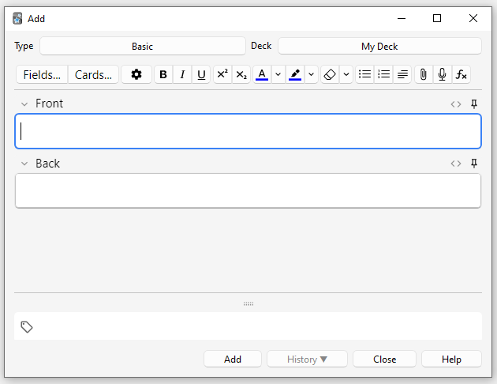
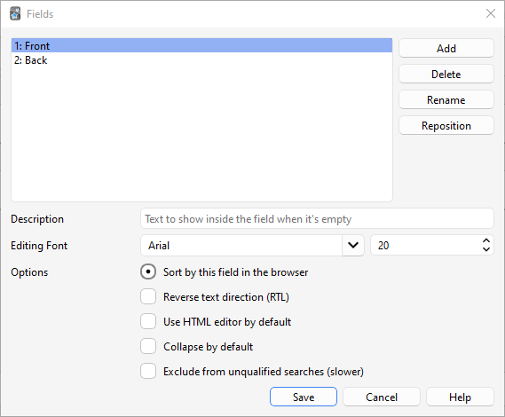
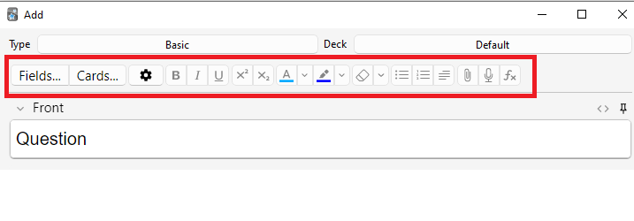
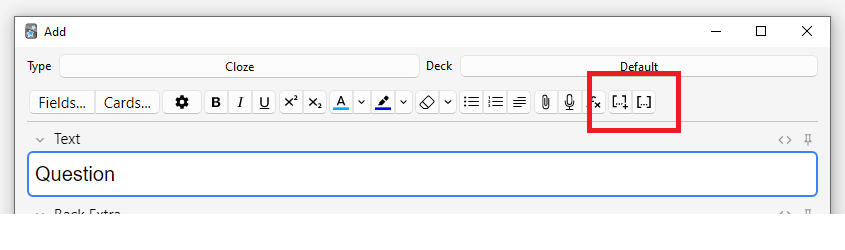
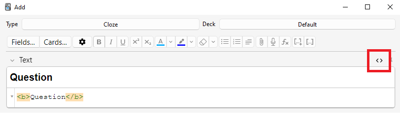
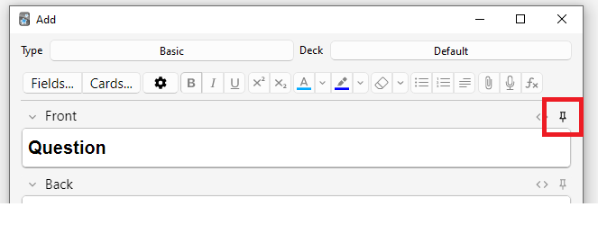
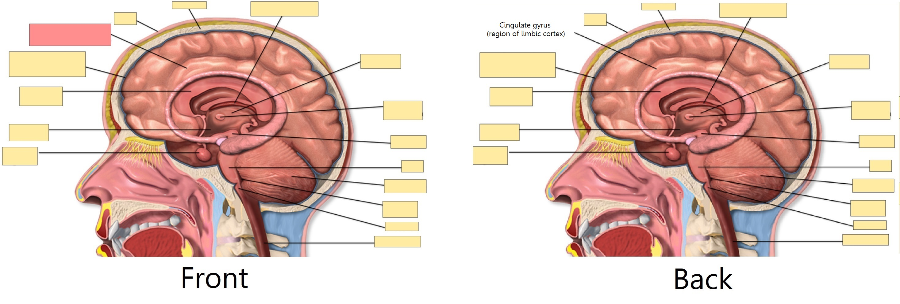
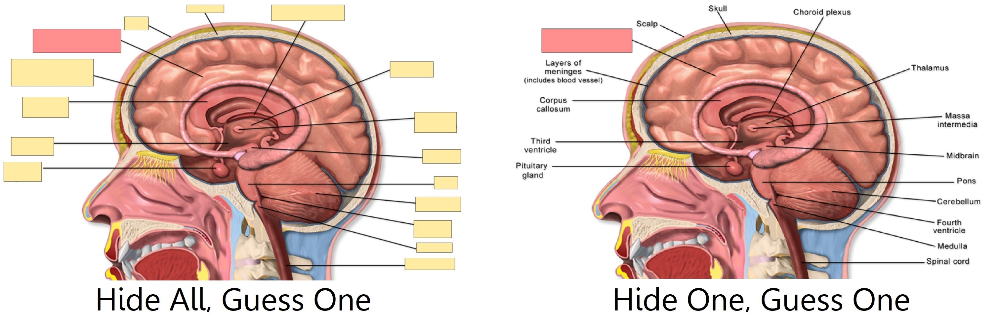

# Добавление/Редактирование

<!-- toc -->

## Добавление карточек и записей

Как мы уже знаем из [начал](getting-started.md), в Anki мы добавляем записи, а не карточки, и Anki создает карточки за нас. Нажмите **Добавить** в [главном окне](studying.md#Колоды), и появится окно Добавление записей.



В левом верхнем углу окна отображается текущий [тип записи](getting-started.md#Типы-записей). Если там не указано "Простая", возможно, вы добавили несколько типов записей при загрузке общей колоды. Текст ниже предполагает, что выбрана "Простая".

В правом верхнем углу окна показана [колода](getting-started.md#Колоды), в которую будут добавляться карточки. Если вы хотите добавить карточки в новую колоду, нажмите на кнопку с названием колоды, а затем нажмите **Добавить**.

Под типом записи вы увидите несколько кнопок и область с названиями "Front" (перед) и "Back" (зад). Передняя и задняя стороны называются [полями](getting-started.md#Записи-и-поля). Вы можете добавлять, удалять и переименовывать их, нажав кнопку "Поля…​" выше.

Под полями находится другая область с названием "**Метки**". Метки — это ярлыки, которые можно прикреплять к записям, чтобы упростить их организацию и поиск. При желании вы можете оставить поле меток пустым или добавить одну или несколько меток. Метки разделяются пробелом. Если в области меток написано

    vocab check_with_tutor

…​то у добавляемой записи будет две метки.

Когда вы ввели текст на переднюю и заднюю стороны, вы можете нажать кнопку **Добавить** или нажать <kbd>Ctrl</kbd>+<kbd>Enter</kbd>  (<kbd>Command</kbd>+<kbd>Enter</kbd> на Mac), чтобы добавить запись в вашу коллекцию. При этом также будет создана карточка и помещена в выбранную вами колоду. Если вы хотите отредактировать добавленную карточку, вы можете нажать кнопку **История**, чтобы найти недавно добавленную карточку в [Просмотре](browsing.md).

Дополнительную информацию о кнопках между типом записи и полями можно найти в разделе [Функции редактирования](editing.md#Функции-редактирования).

### Проверка на дубликаты

Anki проверяет уникальность первого поля, поэтому программа предупредит вас, если вы введете две карточки с одинаковым значением в поле 
"Front", например, "яблоко". Проверка на уникальность ограничена текущим типом записей, поэтому при изучении нескольких языков две карточки с одинаковой передней стороной не будут считаться дубликатами, если для каждого языка используется свой тип записи.

По соображениям производительности Anki не проверяет дубликаты в других полях автоматически, но в Просмотре есть функция "Найти повторы", которую можно запускать периодически.

### Эффективное обучение

Разные люди предпочитают учиться по-разному, но есть несколько общих концепций, которые следует иметь в виду. Отличное введение — [эта статья](https://super-memory.com/articles/20rules.htm) на сайте SuperMemo. В частности:

- **Будьте проще**: Чем короче ваши карточки, тем легче их повторять. Вас может искушать желание включить много информации "на всякий случай", но повторение быстро станет утомительным.

- **Не запоминайте без понимания**: Если вы изучаете язык, старайтесь избегать больших списков слов. Лучший способ выучить язык — в контексте, то есть видеть эти слова использованными в предложении. Аналогично, представьте, что вы изучаете компьютерный курс. Если вы попытаетесь запомнить гору аббревиатур, вам будет очень трудно продвигаться. Но если вы потратите время на понимание концепций, стоящих за аббревиатурами, их запоминание станет намного проще.

## Добавление типа записи

Хотя базовых типов записей достаточно для простых карточек со словом или фразой на каждой стороне, как только вы захотите включить более одного элемента информации на переднюю или заднюю сторону, лучше разбить эту информацию на несколько полей.

Вы можете подумать: "но мне нужна только одна карточка, так почему я не могу просто включить аудио, картинку, подсказку и перевод в поле Front?" Если вы предпочитаете так делать, это нормально. Но недостаток такого подхода в том, что вся информация оказывается "склеенной". Если вы захотите отсортировать карточки по подсказке, вы не сможете этого сделать, потому что она перемешана с другим содержимым. Вы также не сможете, например, перенести аудио с передней стороны на заднюю, кроме как путем кропотливого копирования и вставки для каждой записи. Храня контент в отдельных полях, вы значительно упрощаете будущую корректировку макета ваших карточек.

Чтобы создать новый тип записи, выберите «**Инструменты > Управление типами записей**» в главном окне Anki. Затем нажмите **Добавить**, чтобы добавить новый тип записи. Появится еще один экран, предлагающий выбрать тип записи, на котором будет основываться новый тип. "Добавить" означает создать новый тип на основе одного из встроенных в Anki. "Клонировать" означает создать новый тип на основе уже существующего в вашей коллекции. Например, если вы уже создали тип для французского вокабуляра, вы можете клонировать его при создании типа для немецкого вокабуляра.

После нажатия ОК вам будет предложено дать имя новому типу. Хорошим выбором будет название изучаемого материала — например, "Японский", "Викторины" и так далее. После выбора имени закройте окно типов записей, и вы вернетесь в окно добавления.

## Настройка полей

Чтобы настроить поля, нажмите кнопку **Поля...** при добавлении или редактировании записи, либо когда тип записи выбран в окне Управление типами записей.



Вы можете добавлять, удалять или переименовывать поля, нажимая соответствующие кнопки.

Чтобы изменить порядок отображения полей в этом диалоговом окне и в окне добавления записей, вы можете использовать кнопку изменения позиции **Переместить**, которая запрашивает числовой номер позиции, которую вы хотите присвоить полю. Так, если вы хотите сделать поле новым первым полем, введите "1".

Кроме того, вы можете перетаскивать имена полей для изменения порядка. Для этого используйте мышь или палец, чтобы перетащить поле на нужную позицию. Индикатор покажет, куда будет перемещено поле.

Не используйте "Tags", "Type", "Deck", "Card", или "FrontSide" в качестве имен полей, так как они являются [специальными полями](templates/fields.md#Специальные-поля) и не будут работать должным образом.

Параметры в нижней части экрана позволяют редактировать различные свойства полей, используемых при добавлении и редактировании карточек. Здесь _не_ настраивается то, что отображается на ваших карточках во время повторения; для этого обратитесь к разделу [шаблоны](templates/intro.md).

- **Шрифт в редакторе** позволяет настроить шрифт и размер, используемые при редактировании записей. Это полезно, если вы хотите сделать неважную информацию меньше или увеличить размер нелатинских символов, которые трудно читать. Внесенные здесь изменения не влияют на то, как карточки выглядят при повторении: для этого обратитесь к разделу [шаблоны](templates/intro.md). Однако, если вы включили функцию "type in the answer" ("с вводом ответа"), вводимый вами текст будет использовать размер шрифта, заданный здесь. (Информацию о том, как изменить фактический гарнитуру шрифта при вводе ответа, см. в разделе [проверка ответа](templates/fields.md#Проверка-вашего-ответа).)

- **Сортировать список по этому полю...** указывает Anki отображать это поле в колонке Поле сортировки в Просмотре. Вы можете использовать это для сортировки карточек по этому полю. Одновременно только одно поле может быть полем сортировки.

- **Направление письма справа налево** полезно, если вы изучаете языки с письмом справа налево (RTL), такие как арабский или иврит. В настоящее время этот параметр управляет только редактированием; чтобы текст правильно отображался во время повторения, вам нужно будет настроить свой [шаблон](templates/styling.md#Направление-текста).

- **Использовать HTML по умолчанию** полезно, если вы предпочитаете редактировать поля непосредственно в HTML.

- **Сворачивать по умолчанию**. Поля можно сворачивать/разворачивать. Анимацию можно отключить в [настройках.](preferences.md)

- **Исключить из поиска без указания поля (медленнее)** можно использовать, если вы хотите, чтобы содержимое определенного поля не появлялось в неуточненных [(не ограниченных конкретным полем)](searching.md#Ограничение-по-полю) поисках.

После того как вы добавили поля, вам, вероятно, захочется добавить их на переднюю или заднюю сторону ваших карточек. Для получения дополнительной информации об этом обратитесь к разделу [шаблоны](templates/intro.md).

## Изменение колоды / типа записи

При добавлении вы можете нажать на кнопку в верхнем левом углу, чтобы изменить тип записи, и на кнопку в верхнем правом углу, чтобы изменить колоду. В открывшемся окне вы сможете не только выбрать колоду или тип записи, но и добавить новые колоды или управлять уже имеющимися типами записей.

## Организация контента

### Правильное использование колод

[Колоды](getting-started.md#Колоды) предназначены для разделения вашего контента на широкие категории, которые вы хотите изучать отдельно, например, "Английский", "География" и так далее. Вас может искушать желание создать множество маленьких колод для организации контента, например, "моя книга по географии глава 1" или "глаголы еды", но это не рекомендуется по следующим причинам:

- Множество маленьких колод может означать, что вы в итоге будете видеть карточки в узнаваемом порядке. В старых версиях планировщика новые карточки могут вводиться только в порядке колод. И если вы планируете щелкать по каждой колоде по очереди (что медленно), вы в итоге увидите все повторения из "главы 1" или "глаголов еды" вместе. Это облегчает ответы на карточки, так как вы можете угадать их из контекста, что приводит к более слабому запоминанию. Когда вам нужно будет вспомнить слово или фразу вне Anki, у вас не всегда будет роскошь сначала увидеть связанный контент!

- Хотя это меньшая проблема, чем в ранних версиях Anki, добавление сотен колод может вызвать замедление работы, а очень большие деревья колод с тысячами элементов могут фактически сломать отображение списка колод в версиях Anki до 2.1.50.

### Использование меток

Вместо создания множества маленьких колод лучше использовать метки и/или поля для классификации вашего контента. Метки — это полезный способ улучшить результаты поиска, найти конкретный контент и поддерживать порядок в коллекции.
Существует множество способов эффективного использования меток и флагов, и заблаговременное обдумывание того, как вы хотите их использовать, поможет вам решить, что лучше всего подойдет для вас.

Некоторые люди предпочитают использовать колоды и подколоды для организации своих карточек, но использование меток дает большое преимущество перед колодами: вы можете добавить несколько меток к одной записи, но одна карточка может принадлежать только одной колоде, что делает метки более мощной и гибкой системой категоризации, чем колоды в большинстве случаев. Вы также можете организовывать метки в деревья [так же, как вы можете это делать с колодами](getting-started.md#Колоды).

Например, вместо создания колоды "глаголы еды" вы могли бы добавить эти карточки в свою основную колоду для изучения языка и пометить карточки метками "еда" и "глагол". Поскольку каждая карточка может иметь несколько меток, вы можете делать такие вещи, как [искать](searching.md#Метки-колоды-карточки-и-записи) все глаголы, или всю лексику, связанную с едой, или все глаголы, связанные с едой.

Вы можете добавлять метки из окна Редактировать и из [Просмотра](browsing.md), а также добавлять, удалять, переименовывать или организовывать их там. Обратите внимание, что метки работают на уровне [записи](getting-started.md#Записи-и-поля), что означает, что когда вы помечаете карточку, у которой есть родственные карточки, все родственные карточки также будут помечены. Если вам нужно пометить отдельную карточку, но не ее родственные, вам следует вместо этого рассмотреть возможность использования флагов.

### Использование флагов

Флаги похожи на метки, но они появляются во время обучения в окне повторения, показывая цветной значок флага в правой верхней области экрана. Вы также можете искать отмеченные флагами карточки на экране Просмотра, переименовывать флаги из Просмотра и создавать фильтрованные колоды из отмеченных флагами карточек, но, в отличие от меток, одна карточка одновременно может иметь только один флаг. Еще одно важное отличие заключается в том, что флаги работают на уровне [карточки](getting-started.md#Карточки), поэтому установка флага на карточку, у которой есть родственные карточки, никак не повлияет на родственные карточки.

Вы можете устанавливать/снимать флаги непосредственно в режиме повторения (нажимая <kbd>Ctrl</kbd>+<kbd>1-7</kbd> в Windows или <kbd>Cmd</kbd>+<kbd>1-7</kbd> на Mac) и из [Просмотра.](browsing.md)

### Метка "Marked"

Anki обрабатывает метку под названием "marked" особым образом. На экране повторения и на экране Просмотра есть опции для добавления и удаления метки "marked". На экране изучения будет отображаться звездочка, если текущая карточка (точнее, ее запись) имеет эту метку. А на экране Просмотра карточки отображаются другим цветом, если их запись отмечена.

Примечание: Помечивание ("Отметить") в основном оставлено для совместимости со старыми версиями Anki; большинству пользователей вместо этого следует использовать [флаги](editing.md#Использование-флагов).

### Использование полей

Для тех, кто любит поддерживать строгий порядок, вы можете добавить поля в свои записи для классификации контента, например, "книга", "страница" и так далее. Anki поддерживает поиск по конкретным полям, что означает, что вы можете выполнить поиск `"книга:моя книга" страница:63` и немедленно найти то, что ищете.

### Выборочное изучение и фильтрованные колоды

Используя [фильтрованные колоды](filtered-decks.md), вы можете создавать временные колоды на основе поисковых запросов. Это позволяет вам большую часть времени повторять контент вперемешку в одной колоде (для оптимального запоминания), но также создавать временные колоды, когда вам нужно сосредоточиться на конкретном материале, например, перед тестом. Общее правило таково: если вы всегда хотите иметь возможность изучать какой-то контент отдельно, он должен находиться в обычной колоде; если вам лишь иногда нужно изучать его отдельно (для теста, при наличии отставания и т.д.), то лучше подойдут фильтрованные колоды, созданные на основе меток, флагов, пометок "marked" или полей.

## Функции редактирования

Редактор отображается при [добавлении записей](editing.md), [редактировании записи](studying.md#Редактирование-и-другое) во время повторений или в [Просмотре](browsing.md).



В левом верхнем углу находятся две кнопки, которые открывают окна [полей](editing.md#Настройка-полей) и [карточек](templates/intro.md).

Справа находятся кнопки, управляющие форматированием. Полужирный, курсив и подчеркивание работают так же, как в текстовом редакторе. Следующие две кнопки позволяют сделать текст нижним или верхним индексом, что полезно для химических соединений, таких как H<sub>2</sub>O, или простых математических уравнений, например x<sup>2</sup>. Далее есть две кнопки для изменения цвета текста.

Кнопка с ластиком (резинкой) очищает любое форматирование выделенного текста — включая цвет текста, полужирное начертание и т.д. Следующие три кнопки позволяют создавать списки, выравнивать текст и изменять отступы.

Вы можете использовать кнопку со скрепкой, чтобы выбрать аудио, изображения и видео с жесткого диска вашего компьютера и прикрепить их к своим записям. Кроме того, вы можете скопировать медиафайл в буфер обмена вашего компьютера (например, щелкнув правой кнопкой мыши по изображению в интернете и выбрав "Копировать изображение") и вставить его в нужное поле. Для получения дополнительной информации о медиафайлах обратитесь к разделу [Медиафайлы](media.md).

Значок микрофона позволяет выполнить запись с микрофона вашего компьютера и прикрепить её к записи.

Кнопка Fx покажет выпадающий список с командами для добавления MathJax или [LaTeX](math.md) в ваши записи.

Кнопки \[…​\] видны, когда выбран тип записи "Задание с пропусками".


Кнопка `</>` позволяет редактировать базовый HTML-код поля.


В Anki 2.1.45+ поддерживается настройка закрепленных полей непосредственно с экрана редактирования. Если вы нажмете на значок булавки справа от поля, Anki не будет очищать содержимое этого поля после добавления записи. Если вы часто вводите одно и то же содержимое в несколько записей, это может оказаться полезным. В предыдущих версиях Anki закрепленные поля включались на экране Поля.



У большинства кнопок есть клавиши быстрого доступа. Вы можете навести указатель мыши на кнопку, чтобы увидеть ее сочетание клавиш.

При вставке текста Anki по умолчанию сохраняет большую часть форматирования. Если при вставке удерживать нажатой клавишу <kbd>Shift</kbd>, Anki удалит большую часть форматирования. В Настройках вы можете изменить параметр "Вставка без форматирования (удерживая Shift — противоположное)", чтобы изменить поведение по умолчанию.

## Заполнение пропусков

_Заполнение пропусков_ ("Задание с пропусками") — это процесс скрытия одного или нескольких слов в предложении. Например, если у вас есть предложение:

    Канберра была основана в 1913 году.

…​и вы создаете пропуск на слове "1913", то предложение станет:

    Канберра была основана в [...].

Иногда части, удаленные таким образом, называют "скрытыми".

Для получения дополнительной информации о том, зачем использовать пропуски, см. Правило 5 [здесь](https://super-memory.com/articles/20rules.htm).

Anki предоставляет специальный тип записи для пропусков, чтобы упростить их создание. Чтобы создать запись с пропусками, выберите тип записи "Задание с пропусками" и введите текст в поле "Текст". Затем выделите текст, который хотите скрыть, и нажмите кнопку \[…​\]. Anki заменит текст на:

    Канберра была основана в {{c1::1913}}.

Часть "c1" означает, что вы создали один пропуск в предложении. При желании вы можете создать более одного пропуска. Например, если выделить "Канберра" и снова нажать \[…​\] (справа знак + у кнопки, а иначе будет тоже c1), текст будет выглядеть так:

    {{c2::Канберра}} была основана в {{c1::1913 году}}.

При добавлении вышеуказанной записи Anki создаст две карточки. На первой карточке будет отображаться:

    Канберра была основана в [...].

…​на лицевой стороне, где вопрос, а полное предложение — на обороте. На другой карточке будет следующий вопрос:

    [...] была основана в 1913 году.

Вы также можете скрыть несколько частей на одной карточке. В приведенном выше примере, если изменить c2 на c1, будет создана только одна карточка, на которой скрыты и "Канберра", и "1913". Если при создании пропуска удерживать <kbd>Alt</kbd>  (<kbd>Option</kbd> на Mac), Anki автоматически будет использовать тот же номер вместо увеличения (здесь имеется ввиду то, что используют горячие клавиши для создания пропуска: <kbd>Ctrl+Shift+C</kbd> и <kbd>Ctrl+Alt+Shift+C</kbd>)

Пропуски не обязательно должны совпадать с границами слов, поэтому если в приведенном примере выбрать "анберра", а не "Канберра", вопрос будет выглядеть как "К\[…​\] была основана в 1913 году", что дает вам подсказку.

Вы также можете добавлять подсказки, которые не совпадают с текстом. Если заменить исходное предложение на:

    Канберра::город была основана в 1913 году

…​а затем нажать \[…​\] после выделения "Канберра::город", Anki воспримет текст после двойного двоеточия как подсказку, преобразуя текст в:

    {{c1::Канберра::город}} была основана в 1913 году

Когда карточка появится для повторения, она будет выглядеть так:

    [город] была основана в 1913 году.

Для получения информации о проверке вашей способности правильно вводить текст в пропуске, см. раздел [ввод ответов](templates/fields.md#Проверка-вашего-ответа).

Начиная с версии 2.1.56 поддерживаются вложенные пропуски. Например, следующее является допустимым:

    {{c1::Канберра была {{c2::основана}}}} в 1913 году

Внутренний пропуск полностью вложен во внешний. Частичные перекрытия, такие как:

    [...] основана в 1913 году -> Канберра была
    Канберра [...] в 1913 году -> была основана

со словом "была", появляющимся в обоих пропусках, не поддерживаются.

Текущая реализация может обрабатывать только ограниченное количество уровней вложенности. В Anki 24.11 это 3 уровня. В других версиях предел составляет около 8, но Anki может замедляться при приближении к пределу. Расширить предел невозможно. Если вы используете эту функцию, рекомендуется ограничиться несколькими уровнями вложенности.

До версии 2.1.56, если вам нужно создать пропуски из перекрывающегося текста, добавьте еще одно поле "Текст" в вашу запись с пропусками, добавьте его в [шаблон](templates/intro.md), а затем при создании записей вставьте текст в два отдельных поля, например:

    Поле Текст1: {{c1::Канберра была основана}} в 1913 году

    Поле Текст2: {{c2::Канберра}} была основана в 1913 году

В типе записи "Задание с пропусками" по умолчанию есть второе поле "Дополнение оборота", которое отображается на стороне ответа каждой карточки. Его можно использовать для добавления заметок по использованию или дополнительной информации.

Тип записи "Задание с пропусками" обрабатывается Anki особым образом и не может быть создан на основе обычного типа записи. Если вы хотите его настроить, обязательно клонируйте существующий тип "Задание с пропусками", а не другой тип записи. Можно настраивать такие вещи, как форматирование, но добавить дополнительные шаблоны карточек к типу записи "Задание с пропусками" невозможно.

## Скрытие части изображений

Anki 23.10+ поддерживает карточки со скрытием части изображений (Image Occlusion) "из коробки". Запись со скрытием части изображения (IO) — это особый случай пропуска, основанный на изображениях, а не на тексте, который позволяет создавать карточки, скрывающие некоторые части изображения, проверяя ваше знание этой скрытой информации.



### Добавление изображения

Чтобы добавить карточки IO в вашу коллекцию, откройте экран Добавления, нажмите на "Тип" и выберите "Скрытие части изображений" ("Image Occlusion" для анг. версии)  из списка встроенных типов записей. Затем нажмите **Выберите изображение**, чтобы загрузить файл изображения, сохраненный на жестком диске вашего компьютера, или нажмите **Вставить изображение из буфера**, если у вас есть изображение, скопированное в буфер обмена.

### Добавление карточек IO

После загрузки изображения откроется редактор IO. Нажимайте на значки слева, чтобы добавить на изображение столько областей, сколько хотите. Доступны три основные формы:

- Прямоугольник
- Овал
- Многоугольник

Вы также можете выбрать один из двух различных режимов IO для каждой записи:

- **Спрятать всё, проверять одно**: Все области скрыты, и во время изучения открывается только одна область за раз.
- **Спрятать одно, проверять одно**: За раз скрыта только одна область, и она будет открыта во время изучения. Остальные области будут видны.



<!-- fields & tags are not intuitive to find in editor -->
В типе записи IO по умолчанию также есть стандартные поля:
**Заголовок** (отображается над изображением на передней и задней стороне каждой карточки),
**Дополнение оборота** (отображается под изображением на обороте каждой карточки)
и **Комментарии** (не отображаются на карточках). Чтобы получить к ним доступ из редактора IO,
нажмите кнопку **Переключатель изменения маски**.
Там вы также можете просматривать и редактировать **Метки** записи.

Когда закончите, нажмите кнопку "Добавить" в нижней части экрана.
Anki добавит по одной карточке для каждой фигуры или группы фигур, добавленных на предыдущем шаге, и вы сможете приступить к их обычному повторению.

## Редактирование записей IO

Вы можете редактировать свои записи IO, нажав "Редактировать" во время повторения или непосредственно из Просмотра. Доступно несколько инструментов, которые вы можете использовать. Среди них:

- Выбор: позволяет выбрать одну или несколько фигур для перемещения, изменения размера, удаления или их группировки.
- Масштаб: вы можете свободно перемещать изображение и увеличивать или уменьшать масштаб с помощью колесика мыши.
- Фигуры (Прямоугольник, Овал или Многоугольник): используйте их для добавления новых фигур/карточек.
- Текст: добавляет текстовые области на ваше изображение. Эти текстовые области можно перемещать, изменять их размер или удалять, но при использовании этого инструмента карточка создаваться не будет.
- Отменить / Повторить.
- Увеличить / Уменьшить - Сбросить масштаб.
- Переключить полупрозрачность: используйте этот инструмент для временного просмотра скрытых областей.
- Удалить: используйте этот инструмент для удаления выбранных фигур и текстовых областей. Обратите внимание, что удаление фигуры не приведет к автоматическому удалению связанной с ней карточки; после этого вам нужно будет использовать «**Инструменты > Пустые карточки**», как и в случае с обычными пропусками.
- Создать копию.
- Выбрать группу: используйте этот инструмент для создания кластера фигур, что позволит перемещать, изменять их размер или удалять их одновременно. Обратите внимание, что из двух или более отдельных фигур после группировки будет создана только одна карточка.
- Распустить группу: выберите группу, затем нажмите эту кнопку, чтобы снова сделать каждую фигуру независимой.
- Выравнивание: этот инструмент можно использовать для выравнивания ваших фигур/текстовых областей по желанию.

Во время повторения карточек IO под изображением будет появляться кнопка "Переключить маски". Эта кнопка временно очистит все фигуры записи при использовании режима "Спрятать всё, проверять одно".

## Ввод нелатинских символов и диакритических знаков

Все современные компьютеры имеют встроенную поддержку ввода диакритических знаков и нелатинских символов, а также множество способов это сделать. Мы рекомендуем использовать раскладку клавиатуры для языка, который вы изучаете.

Языки с отдельной письменностью, такие как японский, китайский, тайский и т.д., имеют свои собственные раскладки, специфичные для этого языка.

Европейские языки, использующие диакритические знаки, могут иметь свою собственную раскладку, но часто их можно вводить с помощью универсальной "международной раскладки клавиатуры". Они работают путем ввода диакритического знака, а затем символа, который нужно изменить — например, апостроф (<kbd>´</kbd>), затем буква а (<kbd>a</kbd>) дает á.

### Добавление международных раскладок клавиатуры
Инструкции по использованию международных клавиатур различаются в зависимости от операционной системы и среды рабочего стола. Для начала ознакомьтесь со ссылками ниже.

Windows:
- <https://thegeekpage.com/how-to-add-us-international-keyboard-in-windows-10/>
  
Mac:
- <http://www.macworld.com/article/1147039/os-x/accentinput.html>
  
Linux:
- Gnome: <https://help.gnome.org/users/gnome-help/stable/tips-specialchars.html.en>
- KDE Plasma: <https://userbase.kde.org/Tutorials/ComposeKey>

### Добавление раскладок клавиатуры для конкретных языков
Клавиатуры для конкретных языков добавляются аналогичным образом, но мы не можем охватить их все здесь. Для получения дополнительной информации попробуйте поискать в интернете "input Japanese on a mac", "type Chinese on Windows 10", и так далее.

Для Linux лучше всего обратиться к вики-страницам вашего дистрибутива, например,
[Arch Linux](https://wiki.archlinux.org/title/Input_method) и
[Debian Linux](https://wiki.debian.org/Keyboard#Modern_strategy).
Например, установка `apt install ibus-anthy` в Debian позволит вам вводить символы хираганы.

### Языки с письмом справа налево
Если вы изучаете язык с письмом справа налево, нужно учитывать множество других аспектов. Дополнительную информацию см. на [этой странице](http://dotancohen.com/howto/rtl_right_to_left.html).

### Ограничения
Инструментарий, на котором построена Anki, испытывает трудности с некоторыми методами ввода, такими как удержание клавиш для выбора символов с диакритикой в macOS и ввод символов путем удержания клавиши <kbd>Alt</kbd> и набора цифрового кода в Windows.

## Нормализация Юникода

Текст, такой как `á`, может быть представлен на компьютере несколькими способами, например, с использованием специального кода для этого символа или с использованием стандартного `a` и затем другого кода для диакритического знака сверху. Это вызывает проблемы при смешивании ввода из разных источников или при использовании разных компьютеров — если ваш компьютер обрабатывает ввод с клавиатуры в одной форме, а контент хранится в другой форме, при поиске совпадения не будет, хотя конечный результат выглядит идентично.

Чтобы контент можно было легко найти при поиске, Anki нормализует текст до стандартной формы. Для большинства пользователей этот процесс незаметен, но если вы изучаете определенный материал, например, архаичные японские символы, процесс нормализации может преобразовать их в более современный эквивалент.

Если вы хотите сохранить варианты символов, следующая команда в [консоли отладки](./misc.md) отключит нормализацию:

```python
mw.col.conf["normalize_note_text"] = False
```

Любой контент, добавленный после этого, останется нетронутым. Платой за это может стать сложность поиска контента при переходе между операционными системами или вставке контента из смешанных источников.
