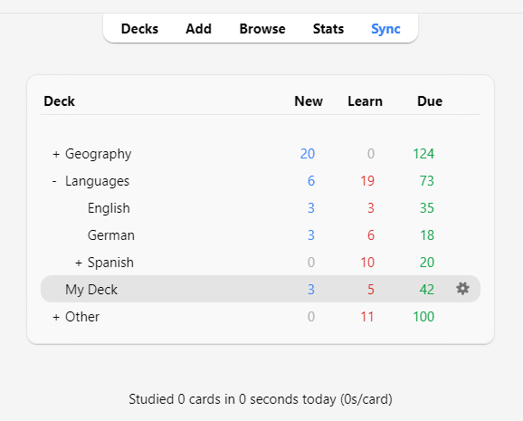
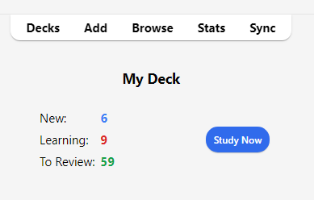
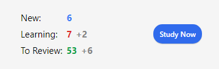

# Изучение

<!-- toc -->

Когда вы нашли понравившуюся колоду или добавили несколько записей, пришло время приступить к изучению.

## Колоды

Изучение в Anki ограничено текущей выбранной колодой, а также любыми содержащимися в ней подколодами.

На экране колод ваши колоды и подколоды будут отображаться в виде списка. Карточки для [Новых, Изучаемых и Ожидающих повторения (К повторению)](getting-started.md#Состояния-карты) на этот день также будут здесь показаны.

Когда вы нажимаете на колоду, она становится «текущей колодой», и Anki переключается на экран изучения. Вы можете вернуться к списку колод в любое время, нажав «Колоды» в верхней части главного окна. (Вы также можете использовать действие «Учить колоду» в меню, чтобы выбрать новую колоду, или вы можете нажать клавишу <kbd>S</kbd> для изучения текущей выбранной колоды.)

Вы можете нажать кнопку с шестеренкой справа от колоды, чтобы переименовать или удалить колоду, изменить её [параметры](deck-options.md) или [экспортировать](exporting.md) её.

## Обзор изучения

После нажатия на колоду для изучения вы увидите экран, показывающий, сколько карточек запланировано на сегодня. Это называется экраном «обзора колоды»:

Карточки разделены на [три типа](getting-started.md#card-states): Новые, Изучаемые и К повторению.
Если у вас активировано [Откладывание связанных](#Связанные-и-откладывание) в настройках колоды, вы можете увидеть, сколько карточек будет отложено, серым цветом:

Чтобы начать сеанс изучения, нажмите кнопку **Учить**. Anki будет показывать вам карточки до тех пор, пока не закончатся карточки, запланированные на день.

Во время изучения вы можете вернуться к обзору, нажав клавишу <kbd>S</kbd> на клавиатуре.

## Вопросы

Когда карточка показывается, сначала отображается только вопрос. После обдумывания ответа нажмите кнопку **Показать ответ** или клавишу
<kbd>Пробел</kbd>. Затем будет показан ответ. Нормально, если вам требуется немного времени, чтобы вспомнить ответ, но как общее правило, если вы не можете ответить в течение примерно 10 секунд, вероятно, лучше перейти к ответу, чем продолжать мучительно пытаться вспомнить.

## Кнопки ответа

После того как ответ показан, сравните вспомненый вами ответ с показанным ответом и выберите одну из следующих кнопок.

- **Снова**: Выбирайте это, когда ваш ответ неверен или когда вы не смогли вспомнить ответ. Если ваш ответ частично правильный, будьте строги к себе: если в реальной жизни, вне Anki, это считается ошибкой, то в Anki это также считается ошибкой. Обычно вы будете использовать эту кнопку примерно в 5-20% случаев.

  Сочетание клавиш: <kbd>1</kbd>

- **Трудно**: Выбирайте эту кнопку, когда ваш ответ правильный, но вы сомневались в нём или потребовалось много времени, чтобы его вспомнить.

  Сочетание клавиш: <kbd>2</kbd>

- **Хорошо**: Выбирайте это, когда ваш ответ правильный, но для его припоминания потребовались некоторые умственные усилия. При правильном использовании Anki это должна быть самая часто используемая кнопка. Обычно вы будете использовать эту кнопку примерно в 80-95% случаев.

  Сочетание клавиш: <kbd>3</kbd>, <kbd>Пробел</kbd>, <kbd>Enter</kbd>

- **Легко**: Выбирайте это, если ваш ответ правильный и не потребовал никаких умственных усилий для его припоминания.

  Сочетание клавиш: <kbd>4</kbd>

Если вам трудно использовать четыре кнопки ответа, вы можете использовать только кнопки **Снова** и **Хорошо**. Используйте **Снова** для неправильных ответов и **Хорошо** для правильных ответов.

Каждая кнопка ответа показывает следующее время, когда карточка будет снова показана для повторения, если вы выберете эту кнопку. Чтобы узнать о настройках, управляющих следующими интервалами повторения, см. темы [Шаги обучения](deck-options.html#Шаги-обучения), [Забытые](deck-options.md#Забытые), [FSRS](deck-options.html#fsrs) и [Дополнительно](deck-options.md#Дополнительно) в разделе Конфигурация колоды.

## Фактор флуктуации

Когда вы выбираете кнопку ответа для карточки на повторении, Anki также применяет небольшую случайную флуктуацию (отклонение),
чтобы карточки, добавленные в одно и то же время и получившие одинаковые оценки, не шли парами и не всегда выпадали для повторения в один и тот же день.

Изучаемые карточки также могут получить до 5 минут дополнительной задержки, чтобы они не всегда появлялись в одном и том же порядке, но кнопки ответа не будут это отражать. Отключить эту функцию невозможно.

## Редактирование и другое

Вы можете нажать кнопку **Редактировать** в левом нижнем углу, чтобы отредактировать текущую запись. Когда вы закончите редактирование, вы вернетесь к изучению. Экран редактирования работает очень похоже на экран [добавления записей](editing.md).

В правом нижнем углу экрана изучения находится кнопка с надписью **Ещё**. Эта кнопка предоставляет некоторые другие операции, которые вы можете выполнить с текущей карточкой или записью:

- [**Пометить карточку флажком**](editing.md#Использовать-флаги): Добавляет цветной маркер на карточку или убирает его. Флажки отображаются во время изучения, и вы можете искать карточки с флажками в окне Просмотра. Это полезно, когда вы хотите выполнить какое-либо действие с карточкой позже, например, посмотреть значение слова, когда вернетесь домой. Если вы используете Anki 2.1.45+, вы также можете переименовывать флажки в [Просмотре](browsing.md).

- **Отложить карточку / запись**: Скрывает карточку или все карточки записи от повторения до следующего дня. (Если вы хотите вернуть отложенные карточки раньше, вы можете нажать кнопку «Вернуть» на экране [обзора колоды](studying.md#Обзор-изучения).) Это полезно, если вы не можете ответить на карточку в данный момент или хотите вернуться к ней в другой раз. Откладывание также может [происходить автоматически](studying.md#Связанные-и-откладывание) для карточек одной и той же записи.

- **Сбросить карточку**: Перемещает текущую карточку в [конец очереди новых](browsing.md#Карточки).

  Опция «Восстановить исходную позицию» позволяет вам сбросить карточку обратно на её исходную позицию при сбросе.

  Опция «Сбросить счетчик количества повторений и забытых», если включена, обнуляет счётчики повторений и неудач для карточки. Она не удаляет историю повторений, которая показывается внизу экрана информации о карточке.

- **Задать срок**: Помещает карточки в очередь на повторение и [делает их запланированными на определённую дату](browsing.md#Карточки).

- **Исключить карточку / запись**: Скрывает карточку или все карточки записи от повторения до тех пор, пока они не будут возвращены вручную (нажатием кнопки исключения в Просмотре). Это полезно, если вы хотите на время исключить повторение записи, но не хотите её удалять.

- **Параметры**: Редактировать [параметры](deck-options.md) для текущей колоды.

- **Сведения о карточке**: Показывает [статистическую информацию](stats.md#Информация-о-карточке) о карточке.

- **Сведения о предыдущей**: Показывает [статистическую информацию](stats.md#Информация-о-карточке) о предыдущей карточке.

- [**Отметить запись**](editing.md#Метка-marked): Добавляет тег «marked» к текущей записи, чтобы её можно было легко найти в Просмотре. Это похоже на установку флажков на отдельные карточки, но работает с тегом, поэтому, если у записи несколько карточек, все карточки будут найдены при поиске по тегу «marked». Большинству пользователей лучше использовать флажки.

- **Создать копию**: Открывает [копию](browsing.md#Найти-повторы) текущей записи в редакторе, который можно немного изменить, чтобы легко получить вариации ваших карточек. По умолчанию карточка-копия будет создана в той же колоде, что и исходная.

- **Удалить запись**: Удаляет запись и все её карточки.

- **Воспроизвести снова**: Если на карточке есть аудио на лицевой или обратной стороне, воспроизвести его снова.

- **Аудио на паузу**: Приостанавливает воспроизведение аудио, если оно играет.

- **Аудио -5 с / +5 с**: Перемотка назад / вперёд на 5 секунд в текущем воспроизводимом аудио.

- **Записать свой голос**: Запись с вашего микрофона для проверки произношения. Эта запись временная и исчезнет, когда вы перейдете к следующей карточке. Если вы хотите добавить аудио к карточке навсегда, вы можете сделать это в окне редактирования.

- **Воспроизвести свой голос**: Воспроизвести предыдущую запись вашего голоса (предположительно, после показа ответа).

## Порядок отображения

Изучение будет показывать карточки из выбранной колоды и всех колод, которые она содержит. Таким образом, если вы выберете колоду «French», подколоды «French::Vocab» и «French::My Textbook::Lesson 1» также будут показаны.

По умолчанию для новых карточек Anki собирает карточки из колод в алфавитном порядке. Таким образом, в приведенном выше примере вы сначала получите карточки из колоды «French», затем «My Textbook» и, наконец, «Vocab». Вы можете использовать это для управления порядком появления карточек, помещая карточки с высоким приоритетом в колоды, которые находятся выше в списке. Когда компьютеры сортируют текст по алфавиту, символ «-» предшествует буквенным символам, а «\~» следует за ними. Таким образом, вы можете назвать колоду «-Лексика», чтобы она появлялась первой, и вы можете назвать другую колоду «\~Мой учебник», чтобы она появлялась после всех остальных.

Новые карточки и карточки для повторения собираются отдельно, и Anki не будет ждать, пока обе очереди опустеют, прежде чем перейти к следующей колоде, поэтому возможно, что вам будут показываться новые карточки из одной колоды, в то время как вы видите повторения из другой колоды, или наоборот. Если вы не хотите этого, нажмите непосредственно на ту колоду, которую хотите изучать, а не на одну из родительских колод.

Поскольку карточки в процессе изучения являются в некоторой степени критичными ко времени, они извлекаются из всех колод сразу и показываются в порядке их запланированного появления.

Для управления порядком появления карточек см. [Порядок показа](./deck-options.md#Порядок-показа). Для более тонкой настройки порядка новых карточек вы можете изменить порядок в [Просмотре](browsing.md).

## Связанные и откладывание

Вспомните из [начал](getting-started.md), что Anki может создавать более одной
карточки для каждой введенной вами информации, например, карточку прямая→обратная и
карточку обратная→прямая, или два разных текста с пропусками из одного и того же текста.
Эти родственные карточки называются «связанными».

Когда вы отвечаете на карточку, у которой есть связанные, Anki может предотвратить показ связанных карточек в той же сессии, автоматически «откладывая» их. Отложенные карточки скрыты от повторения до наступления нового дня или пока вы не вернете их вручную, нажав кнопку «**Вернуть**», которая видна внизу экрана [обзора колоды](studying.md#Обзор-изучения). Anki будет откладывать связанные карточки, даже если они находятся не в той же колоде (например, если вы используете функцию [подмена колоды](templates/intro.md)).

Вы можете включить откладывание на экране [параметры колоды](deck-options.md) — существуют отдельные настройки для новых карточек и для повторений.

Anki будет откладывать только те связанные карточки, которые являются новыми или находятся на повторении. Он не будет скрывать карточки в изучении, так как время для них критично. С другой стороны, когда вы изучаете карточку в процессе изучения, любые связанные новые карточки или карточки на повторении будут отложены.

Также обратите внимание, что карточка не может быть одновременно отложенной и исключенной. Исключение отложенной карточки вернёт её из отложенных. Исключенные карточки не могут быть отложены.

## Горячие клавиши

Большинство распространенных операций в Anki имеют горячие клавиши. Большинство из них можно найти в интерфейсе: пункты меню отображают свои сочетания клавиш рядом с собой, а наведение курсора мыши на кнопку обычно показывает её сочетание клавиш во всплывающей подсказке.

При изучении либо <kbd>Пробел</kbd>, либо <kbd>Enter</kbd> показывают ответ. Когда ответ показан, вы можете использовать <kbd>Пробел</kbd> или <kbd>Enter</kbd>, чтобы выбрать кнопку «Хорошо». Вы можете использовать клавиши <kbd>1</kbd>-<kbd>4</kbd>, чтобы выбрать конкретную кнопку оценки. Многие люди находят удобным отвечать на большинство карточек клавишей <kbd>Пробел</kbd>, держа один палец на клавише <kbd>1</kbd> на случай, если они забыли ответ.

Пункт «**Учить колоду**» в меню Инструменты позволяет быстро переключиться на колоду с помощью клавиатуры. Вы можете вызвать его клавишей <kbd>/</kbd>. При открытии отобразятся все ваши колоды и область фильтра вверху. По мере ввода символов Anki будет показывать только колоды, соответствующие введенным символам. Вы можете добавить пробел для разделения нескольких условий поиска, и Anki покажет только колоды, соответствующие всем условиям. Таким образом, «ja 1» или «on1 ja» подойдут для колоды с названием «Japanese::Lesson1».

## Отставание от графика

Когда вы отстаете от графика повторений, Anki по умолчанию отдает приоритет карточкам, которые ждут дольше всех. Такой порядок гарантирует, что ни одна карточка не останется ждать бесконечно, но это означает, что если вы добавляете новые карточки, их повторения не появятся, пока вы не разберетесь с накопившимся долгом.

Когда вы отвечаете на карточки, которые ждали какое-то время, Anki учитывает эту задержку при определении следующего времени показа карточки. Это означает, что если вы возвращаетесь в Anki после долгого перерыва, вам не нужно начинать все сначала; вы можете просто продолжить с того места, где остановились.